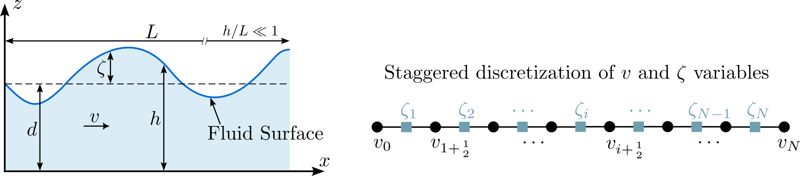

# pi_lecture_pytorch
Tutorial codes for a physics informed machine learning lecture based on shallow water equation.

All executable code is in the notebook [swe_instructor_code_retreat.ipynb](swe_instructor_code_retreat.ipynb).
To directly open the notebook in Google Colab, click the badge below.

[open this notebook on colab](https://colab.research.google.com/github/alicanbekar/pi_lecture_pytorch/blob/main/swe_instructor_code_retreat.ipynb)

# What is this repository for?
This repository contains the codes for a physics informed machine learning lecture based on shallow water equation.



We will use different methods to train a U-net to integrate the shallow water equation in time. The methods are:
1. Vanilla supervised learning
2. Learning the residuals
3. Learning fluxes
4. Hybrid numerical and machine learning approach

# How to use this repository?
All necessary codes are in the notebook [swe_instructor_code_retreat.ipynb](swe_instructor_code_retreat.ipynb). 
The notebook will guide you through the steps in concepts. **Eventually you will hit a cell that on execution displays
two buttons "train" and "load results".** If you select load results, you will not have to wait for the training to finish,
but already pre-trained models will be loaded and you can continue with the next steps. If you wish to play around with
hyper parameters and train your own models, you can select the train button, but keep in mind that training (especially
on colab) will take some time.

## To install
### Conda
```bash
conda env create -f environment.yml
```

### Pip
```bash
pip install -r requirements.txt
```
